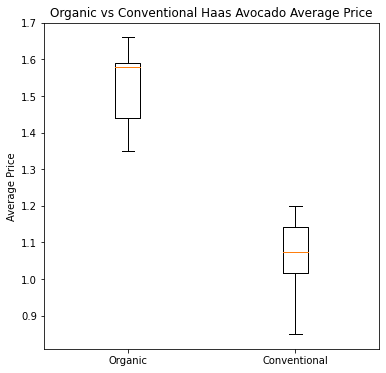
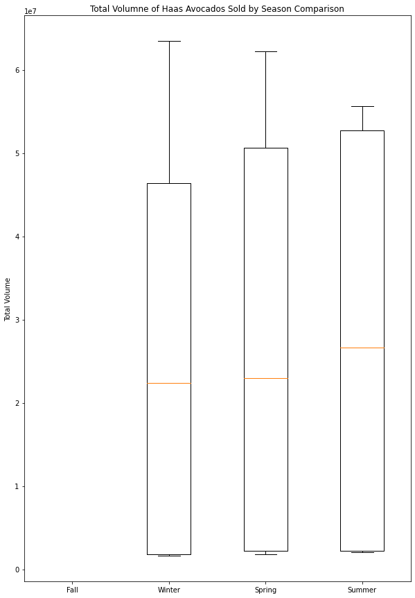

# Hw-1

# Project Overview
Load, clean and explore a dataset of your choice with Python

# My goal 
When I go to the grocery store and look at the avocado selection I wonder if the unit price of avocados fluctuates with the seasons. Moreover, I am interested to see the unit price difference between organic and non-organic Hass avocados purchased.

# Method
This is an updated version of the avocado dataset originally compiled from the Hass Avocado Board (or HAB, for short) data and published on Kaggle by Justin Kiggins in 2018 and updated again by Timofei Kornev in May 2020. The data features historical data on avocado unit prices and sales volume.

1. The updated dataset was created by downloading the data for the year 2020.
2. To download some new data, scroll down to the bottom of the section "Totals by PLU" and click the "Download 2020 Weekly Retail Volume & Price Report" button.
3. 

# Results

# Conclusion

# Content
This updated version contains data form January 2015 up to July 2020.   

Here's how the Hass Avocado Board describes the data on their website:

*The table below represents weekly retail scan data for National retail volume (units) and price. Retail scan data comes directly from retailers’ cash registers based on actual retail sales of Hass avocados. Starting in 2015, the table below reflects an expanded, multi-outlet retail data set. Multi-outlet reporting includes an aggregation of the following channels: grocery, mass, club, drug, dollar and military. The Average Price (of avocados) in the table reflects a per unit (per avocado) cost, even when multiple units (avocados) are sold in bags. The Product Lookup codes (PLU’s) in the table are only for Hass avocados. Other varieties of avocados (e.g. greenskins) are not included in this table.*

Some relevant columns in the dataset:

    Date - The date of the observation
    AveragePrice - the average price of a single avocado
    type - conventional or organic
    Total Volume - Total number of avocados sold
    season - fall, winter, spring and summer

# Acknowledgements

Many thanks to the Hass Avocado Board for sharing this data!!

[Hass Avocado Board](http://www.hassavocadoboard.com/retail/volume-and-price-data)

