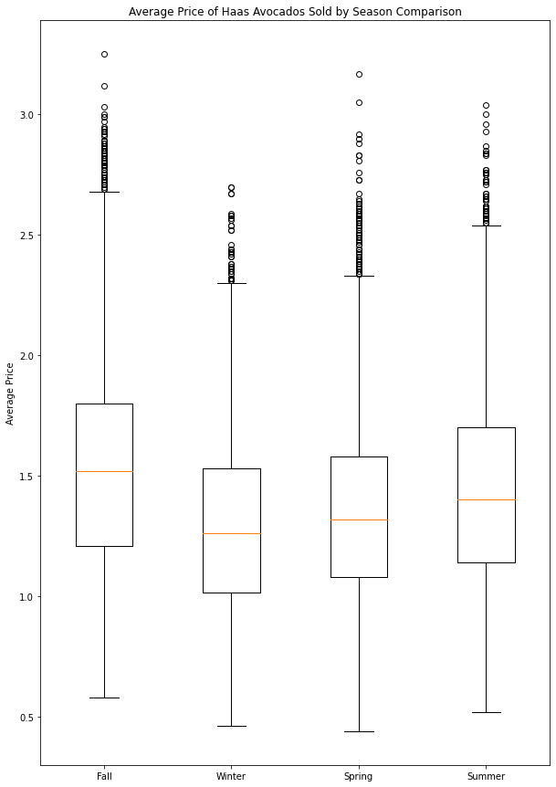

# Hw-1

# Project Overview
Load, clean and explore a dataset of your choice with Python

# My goal 
When I go to the grocery store and look at the avocado selection, I wonder if the unit price of avocados fluctuates with the seasons. Moreover, I am interested to see the unit price difference between organic and non-organic Hass avocados purchased.

# Method
This is an updated version of the avocado dataset originally compiled from the Hass Avocado Board (or HAB, for short) data and published on Kaggle by Justin Kiggins in 2018 and updated again by Timofei Kornev in May 2020 and myself in September 2020. The data features historical data on avocado unit prices and sales volume in units.

1. The updated dataset was created by downloading the data ffrom Timofei Kornev kaggle .csv
2. To download some new data, scroll down to the bottom of the section "Totals by PLU" and click the "Download 2020 Weekly Retail Volume & Price Report" button.
3. The two .csv files were concatenated into data frame = all_data.csv
4. Data frame was cleaned: changes Average Price and Total Volume to_numeric; filtering rows to only Total U.S. data values
5. Season column was added to data to be able to use .groupby
6. Data frame was grouped by Season to show the mean of AveragePrice and sum of Total Volume for all avocados
7. Data frame was additionally grouped by avocado type to see the mean average price between organic and conventional
8. Box and whiskers done using matplotplib.pyplot package to compare step 7

# Results
|Season|Average Price|Total Volume of all avocados|
|:------:|:-------|--------:|
|fall|$1.54|2,959,226,000|
|spring|$1.35|6,315,596,000|
|summer|$1.45|4,510,399,000|
|winter|$1.29|5,658,387,000|

# Conclusion

This data set highlights that the consumer will pay more in the fall months for all Hass avocados. As well as pay appoximately 50% more for organic Hass avocados. Additional twice as many avocados are purchased in the winter and spring months when the average unit price is the lowest.  Lastly, if you are in the store and organic avocados are less than 50% of the price of conventional avocados then that would be a deal!  

# Content
This updated version contains data form January 2015 up to July 2020.   

Here's how the Hass Avocado Board describes the data on their website:

> *The table below represents weekly retail scan data for National retail volume (units) and price. Retail scan data comes directly from retailers’ cash registers based on actual retail sales of Hass avocados. Starting in 2015, the table below reflects an expanded, multi-outlet retail data set. Multi-outlet reporting includes an aggregation of the following channels: grocery, mass, club, drug, dollar and military. The Average Price (of avocados) in the table reflects a per unit (per avocado) cost, even when multiple units (avocados) are sold in bags. The Product Lookup codes (PLU’s) in the table are only for Hass avocados. Other varieties of avocados (e.g. greenskins) are not included in this table.*

Some relevant columns in the dataset:

    Date - The date of the observation
    AveragePrice - the average price of a single avocado
    type - conventional or organic
    Total Volume - Total number of avocados sold
    season - fall, winter, spring and summer

# Acknowledgements

Many thanks to the Hass Avocado Board for sharing this data!!

[Hass Avocado Board](http://www.hassavocadoboard.com/retail/volume-and-price-data)

Thank you to Justin Kiggins and Timofei Kornev for getting me started with the avocado data sets
